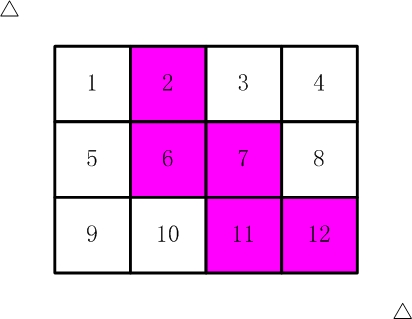

## 剪邮票

如【图1.jpg】, 有12张连在一起的12生肖的邮票。


现在你要从中剪下5张来，要求必须是连着的。
（仅仅连接一个角不算相连）
比如，【图2.jpg】，【图3.jpg】中，粉红色所示部分就是合格的剪取。




请你计算，一共有多少种不同的剪取方法。

请填写表示方案数目的整数。
注意：你提交的应该是一个整数，不要填写任何多余的内容或说明性文字。

## Ideas

最终是想让我们计算”一共有多少种不同的剪取方法“，所以是要搜索所有的状态空间，应该用DFS。

这道题其实就是从12个格子中选出来5个，保证5个格子是联通的。

所以我们可以把问题建模：一个长度为12、元素为0的列表，从中选择5个格子置为1，然后判断5个1的位置对应到矩阵上是不是连通的。

我觉得这道题的考点就是连通块检查，连通块检查可以定义为一个单独的函数，经典的连通块计算方法还是通过DFS。

对于一个矩阵，首先要定义一个变量cnt，用于统计矩阵中为1的元素个数，然后整个遍历一遍矩阵，找到第一个为1的位置，先把 cnt + 1，然后进行 DFS，从当前位置开始，四个方向扩散，如果遇到值为1的元素，则置为0。

注意哈，此时如果所有的1是连通的，那么我从一个1出发，就可以将所有的1都置为0，后面继续遍历矩阵就不会再遇到值为1的元素，所以最后判断是不是连通块就是判断 cnt == 1。

OK，然后就可以开始写代码啦。

## Code

### C++

```cpp
#include <algorithm>
#include <iostream>

using namespace std;

int ans;

bool check(int arr[12]);

void dfs(int g[3][4], int i, int j);

int main(int argc, const char *argv[]) {
    int per[] = {0, 0, 0, 0, 0, 0, 0, 1, 1, 1, 1, 1};
    do {
        if (check(per))
            ans++;
    } while (next_permutation(per, per + 12));
    cout << ans << endl;
    return 0;
}

bool check(int arr[12]) {
    int g[3][4];
    memset(g, 0, sizeof(g));
//将相应位置标注为1
    for (int i = 0; i < 3; ++i) {
        for (int j = 0; j < 4; ++j) {
            if (arr[i * 4 + j] == 1)g[i][j] = 1;
        }
    }
//    经典连通块计算
    int cnt = 0;
    for (int i = 0; i < 3; ++i) {
        for (int j = 0; j < 4; ++j) {
            if (g[i][j] == 1) {
                dfs(g, i, j);
                cnt++;
            }
        }
    }
    return cnt == 1;
}

void dfs(int g[3][4], int i, int j) {
    g[i][j] = 0;
    if (i + 1 <= 2 && g[i + 1][j] == 1) dfs(g, i + 1, j);
    if (i - 1 >= 0 && g[i - 1][j] == 1) dfs(g, i - 1, j);
    if (j + 1 <= 3 && g[i][j + 1] == 1) dfs(g, i, j + 1);
    if (j - 1 >= 0 && g[i][j - 1] == 1) dfs(g, i, j - 1);
}
```

### Python

```python
from copy import deepcopy
from itertools import permutations


def check(m):
	def dfs(x, y):
		m[x][y] = 0
		for dx, dy in [(-1, 0), (1, 0), (0, -1), (0, 1)]:
			nx, ny = x + dx, y + dy
			if -1 < nx < len(m) and -1 < ny < len(m[0]) and m[nx][ny] == 1:
				dfs(nx, ny)

	cnt = 0
	for r in range(3):
		for c in range(4):
			if m[r][c] == 1:
				dfs(r, c)
				cnt += 1
	return cnt == 1


if __name__ == '__main__':
	ans = set()
	state = [0, 0, 0, 0, 0, 0, 0, 1, 1, 1, 1, 1]
	matrix = [[0] * 4 for _ in range(3)]
	for ste in permutations(state):
		# 将一维状态向量映射为二维矩阵
		for i in range(3):
			for j in range(4):
				matrix[i][j] = ste[i * 4 + j]

		string = ''.join([''.join(map(str, row)) for row in matrix])
		if check(deepcopy(matrix)) and string not in ans:   # 连通块检查
			print(string)
			ans.add(string)
	print(len(ans))
```

## Answer: 116