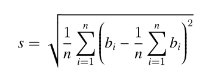

## 付账问题

【题目描述】
几个人一起出去吃饭是常有的事。但在结帐的时候，常常会出现一些争执。

现在有 n 个人出去吃饭，他们总共消费了 S 元。其中第 i 个人带了 ai 元。幸运的是，所有人带的钱的总数是足够付账的，但现在问题来了：每个人分别要出多少钱呢？

为了公平起见，我们希望在总付钱量恰好为 S 的前提下，最后每个人付的钱的标准差最小。这里我们约定，每个人支付的钱数可以是任意非负实数，即可以不是1分钱的整数倍。你需要输出最小的标准差是多少。

标准差的介绍：标准差是多个数与它们平均数差值的平方平均数，一般用于刻画这些数之间的“偏差有多大”。形式化地说，设第 i 个人付的钱为 bi 元，那么标准差为 : 

【输入格式】
从标准输入读入数据。

第一行包含两个整数 n、S；
第二行包含 n 个非负整数 a1,...,an。

【输出格式】
输出到标准输出。

输出最小的标准差，四舍五入保留 4 位小数。
保证正确答案在加上或减去 10^−9 后不会导致四舍五入的结果发生变化。

【样例1输入】
5 2333
666 666 666 666 666

【样例输出】
0.0000

【样例解释】
每个人都出 2333/5 元，标准差为 0。

再比如：
【样例输入】
10 30
2 1 4 7 4 8 3 6 4 7

【样例输出】
0.7928

【数据说明】
对于 10% 的数据，所有 ai 相等；
对于 30% 的数据，所有非 0 的 ai 相等；
对于 60% 的数据，n≤1000；
对于 80% 的数据，n≤10^5；
对于所有数据，n≤5×10^5,0≤ai≤10^9。

资源约定：
峰值内存消耗（含虚拟机） < 256M
CPU消耗  < 1000ms

请严格按要求输出，不要画蛇添足地打印类似：“请您输入...” 的多余内容。

注意：
main函数需要返回0;
只使用ANSI C/ANSI C++ 标准;
不要调用依赖于编译环境或操作系统的特殊函数。
所有依赖的函数必须明确地在源文件中 #include <xxx>
不能通过工程设置而省略常用头文件。

提交程序时，注意选择所期望的语言类型和编译器类型。

## Ideas

需要注意每个人要付的钱数并不是整数，可以是小数，我一开始以为是整数导致怎么算都不对。

首先我们要求的是一个最小的标准差，最优问题，可以想到贪心算法。

标准差表示的数据相对于平均值的波动，也就是说，我们要让每个人付的钱数尽可能的接近平均值。

那么对于带的钱数小于平均值的人，肯定身上所有的钱都得付，然后还不够的钱，由身上带的钱比平均值多的人急需均摊。

如此反复，直到凑够S的钱数就OK啦。

## Code

### Python

