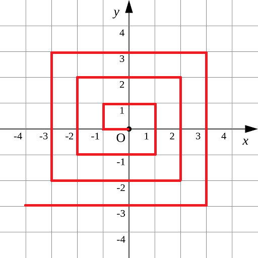
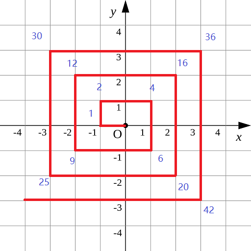

## 螺旋折线

如图p1.png所示的螺旋折线经过平面上所有整点恰好一次。  



对于整点(X, Y)，我们定义它到原点的距离dis(X, Y)是从原点到(X, Y)的螺旋折线段的长度。  

例如dis(0, 1)=3, dis(-2, -1)=9  

给出整点坐标(X, Y)，你能计算出dis(X, Y)吗？

【输入格式】
X和Y  

对于40%的数据，-1000 <= X, Y <= 1000  
对于70%的数据，-100000 <= X， Y <= 100000  
对于100%的数据, -1000000000 <= X, Y <= 1000000000  

【输出格式】
输出dis(X, Y)  


【样例输入】
0 1

【样例输出】
3


资源约定：
峰值内存消耗（含虚拟机） < 256M
CPU消耗  < 1000ms


请严格按要求输出，不要画蛇添足地打印类似：“请您输入...” 的多余内容。

注意：
main函数需要返回0;
只使用ANSI C/ANSI C++ 标准;
不要调用依赖于编译环境或操作系统的特殊函数。
所有依赖的函数必须明确地在源文件中 #include <xxx>
不能通过工程设置而省略常用头文件。

提交程序时，注意选择所期望的语言类型和编译器类型。

## Ideas

一般这种题目都有规律，所以我们需要把前面几个答案都列出来，就有例子了。



然后就是找规律的内容啦，对于四个角的内容，我们可以发现，右上角的值从4 → 16 → 36 ……

可以发现这些都是平方数，即 2 * 2 → 4 * 4  → 6 * 6 ……

再把它们的坐标考虑进来，即 (1 * 2) ^ 2 → (2 * 2) ^ 2  → (2 * 3) ^ 2 ……

找到规律了，能够到达的最外圈右上角的坐标等于 (2 * k) ^ 2。

但是这只是确定了一个坐标的位置，如果在其它文件还需要跟它建立联系。

可以发现，螺旋折线对应的都是直角拐弯，有单类似于曼哈顿距离，如果能想到这一点，这道题就简单了，每个节点的dis距离其实就是它对应的最外圈右上角节点距离 (2 * k) ^ 2 再加上该节点到右上角节点的曼哈顿距离。

## Code

### Python

```python
if __name__ == '__main__':
    x, y = map(int, input().split())
    k = max(abs(x), abs(y))
    if x > y:
        print((2 * k) ** 2 + abs(k - x) + abs(k - y))
    else:
        print((2 * k) ** 2 - abs(k - x) - abs(k - y))
```