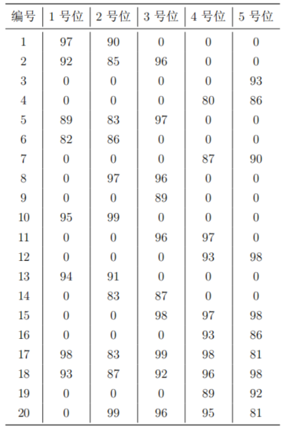

【问题描述】

作为篮球队教练，你需要从以下名单中选出 1 号位至 5 号位各一名球员，组成球队的首发阵容。
每位球员担任 1 号位至 5 号位时的评分如下表所示。
请你计算首发阵容 1 号位至 5 号位的评分之和最大可能是多少？

（在试题目录下有一个文件 team.txt，内容与上面表格中的相同，请注意第一列是编号）

【答案提交】

这是一道结果填空的题，你只需要算出结果后提交即可。
本题的结果为一个整数，在提交答案时只填写这个整数，填写多余的内容将无法得分。