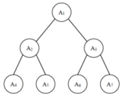

## 【问题描述】

给定一棵包含 N 个节点的完全二叉树，树上每个节点都有一个权值，按从上到下、从左到右的顺序依次是 A1, A2, · · · AN，如下图所示：

现在小明要把相同深度的节点的权值加在一起，他想知道哪个深度的节点权值之和最大？

如果有多个深度的权值和同为最大，请你输出其中最小的深度。

**注：根的深度是 1。**

## 【输入格式】

第一行包含一个整数 N。

第二行包含 N 个整数 A1, A2, · · · AN 。

## 【输出格式】

输出一个整数代表答案。

## 【样例输入】

7
1 6 5 4 3 2 1

## 【样例输出】

2

## 【评测用例规模与约定】

对于所有评测用例，1 ≤ N ≤ 100000，ˈ 100000 ≤ Ai ≤ 100000。