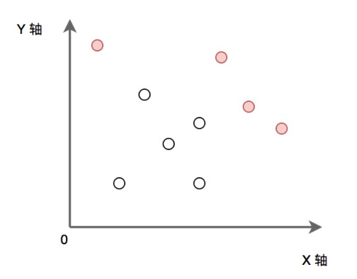

## 字节跳动2018校招算法方向（第一批） —— 最外层点

时间限制：C/C++ 1秒，其他语言2秒

空间限制：C/C++ 32M，其他语言64M

P为给定的二维平面整数点集。定义 P 中某点x，如果x满足 P 中任意点都不在 x 的右上方区域内（横纵坐标都大于x），则称其为“最大的”。求出所有“最大的”点的集合。（所有点的横坐标和纵坐标都不重复, 坐标轴范围在[0, 1e9) 内）

如下图：实心点为满足条件的点的集合。请实现代码找到集合 P 中的所有 ”最大“ 点的集合并输出。



### 输入描述:

第一行输入点集的个数 N， 接下来 N 行，每行两个数字代表点的 X 轴和 Y 轴。

对于 50%的数据,  1 <= N <= 10000;

对于 100%的数据, 1 <= N <= 500000;

### 输出描述:

输出“最大的” 点集合， 按照 X 轴从小到大的方式输出，每行两个数字分别代表点的 X 轴和 Y轴。

### 输入例子1:

```
5
1 2
5 3
4 6
7 5
9 0
```

### 输出例子1:

```
4 6
7 5
9 0
```

## Ideas

首先可以发现所有 ”最大“ 点都在右上方围了一圈，因此可以利用这个特征来做题。

先把所有的点都按照y值排序，那么y值最大的那个点肯定是右下角的“最大”点，记为p0，然后按照y值依次往前遍历，遍历到p点的x值是大于前一个p点的x值，说明找到了一个“最大”点。

## Code

### Python

Python的代码只能过 9/10 组用例，最后一个内存超限，求大佬指点，怎么能过最后一组数据，我感觉可以优化的地方在处理输入的位置，暂时没想到更好的优化方案。

```python
if __name__ == '__main__':
	point_list = []
	n = int(input())
	for _ in range(n):
		point_list.append(tuple(map(int, input().split())))

	max_x = 0
	point_list.sort(key=lambda x: x[1])
	for i in range(n - 1, -1, -1):
		if point_list[i][0] > max_x:
			print(f"{point_list[i][0]} {point_list[i][1]}")
			max_x = point_list[i][0]
```